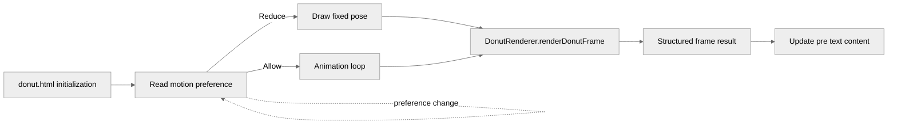

<!-- greptile_summary -->

<h2><a href="https://app.greptile.com/api/retrigger?id=65550211"><picture><source media="(prefers-color-scheme: dark)" srcset="https://greptile-static-assets.s3.amazonaws.com/badges/RetriggerDark.svg?v=2"><source media="(prefers-color-scheme: light)" srcset="https://greptile-static-assets.s3.amazonaws.com/badges/Retrigger.svg?v=2"></picture></a>Confidence Score: 5/5</h2>

The PR appears safe to merge, with no outstanding correctness, security, or repository-rule violations.

<h3>Summary</h3>

The PR adds a self-contained spinning ASCII donut page and separates reusable torus rendering from page-level animation and accessibility orchestration.
- Adds a pure renderer with explicit angle and configuration inputs and a structured frame result.
- Centers the donut in a responsive bordered container sized for mobile viewports.
- Responds dynamically to reduced-motion preference changes.
- Includes desktop animation and mobile visual evidence.

Diagram

Reviews (2) · Last reviewed commit: ["Address review: fit narrow screens, trac..."](https://github.com/tatsumi-03/loop-engineering-test/commit/c67ba973e8e4ec9925c4f94a011d3f8d6164f432)
